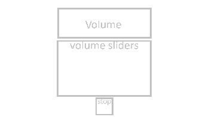
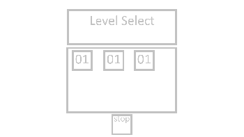

# Game Design Pitch
This is a skeleton/reference for a game design pitch. A full design will be much longer!   

## Working Title
Journey Through Crystal Peaks

## Concept statement  
Solve puzzles by pushing around lasers and mirrors.

## Target audience  
* **Age:** 11 - 35
* **Gender:** N/A
* **Interests:** Puzzles, Casual Games

## Reference
Are there simular games? what are they, how do they relate, how is your game different?
* **Monument Valley:** gameplay is different but my game uses a similar style.
* **Laser Push:** 2D laser maze game, which you can push around the lazers and reflectors.

## Player experience and game POV 

* The player is a basic character, who moves about the world pushing objects in its path
* I want the player to be able to play this game when they just need to relax, and play a simple, yet challenging game.

## Unique Selling Points
What makes your game stand out? How is it different from all other games? 

## Genre(s) 
Single genre is clearer but often less interesting. Genre combinations can be risky. Beware of ‘tired’ genres.
* Puzzle  

## Platform(s) and primary technology 
* Unity 3D, URP
* PC
* Mobile - Android
* Web

## Visual/audio Style 
What is the "look and feel" of the game? How does this support the desired player’s experience? What concept art or reference art can you show to give the feel of the game? 

## Game Systems
What systems are needed to make this game? Which ones are internal (simulation, etc.) and which does the player interact with? 

## Interactivity
How are different kinds of interactivity used? (Perceptual, ST Cognitive, LT Cognitive, Emotional, Social, Cultural) What is the player doing Moment‐by‐moment? How does the player move through the world?  How does physics/combat/etc. work?
* Click to move, the player will walk to where is clicked on screen.
* Reflectors and other objects when pushed of the map will fall back to their original position.
* **Peceptual:** Display a puzzle to the player.
* **Cognitive:** The player processes what they are seeing and attempts to solve the puzzle. 

## Game UI:
A clear, professional‐looking sketch of the primary game UX is helpful. 
- menu concept/wireframe
  

- volume concept/wireframe
  

- level select concept/wireframe
  

- game over & win/wireframe
  

